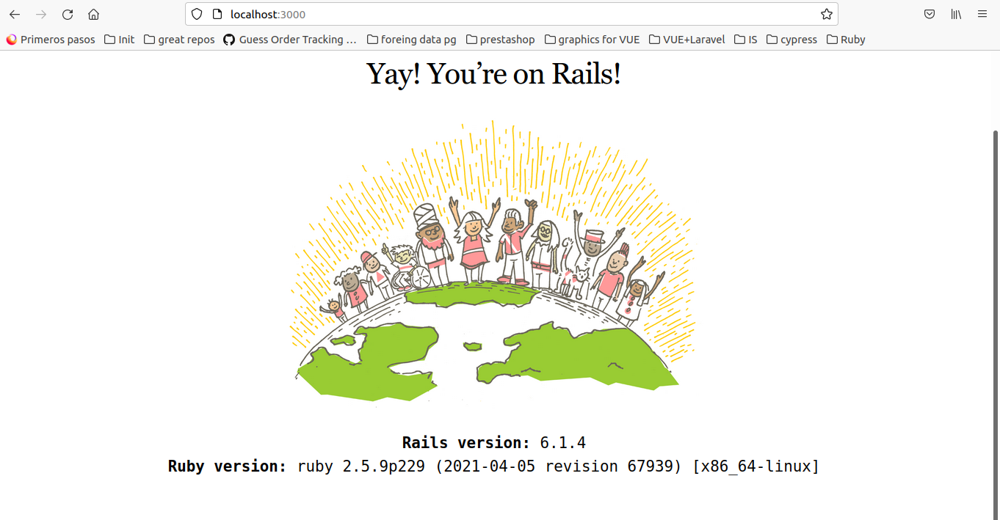

# intro to ruby and rails

this is a autolearning tutorial for to get in touch with ruby and rails.

first of all I generate a docker-compose following (not strictly [docker tutorial for rails](https://docs.docker.com/samples/rails/))

after that we have a fresh installation of a ruby running in a service called `web` and other for a `postgres` database, running `CMD ["tail", "-f", "/dev/null"]` for keep the container up and running ;).

## starting with rails

after that we started to follow this [tutorial](https://guides.rubyonrails.org/v5.2/getting_started.html)

1. installing rails `gem install rails` check the install with `rails --version`

2. creating the app `rails new blog --database=postgresql` This will create a Rails application called `Blog` in a `blog` directory and install the gem dependencies that are already mentioned in `Gemfile` using bundle install.

> You can see all of the command line options that the Rails application builder accepts by running `rails new -h`

3. run this command to get ownership of the folder

```
sudo chown -R $USER:$USER .
```

4. at this point we need to configure our postgres database for the project. go to `config/database.yml` and

```yml
default: &default
  adapter: postgresql
  encoding: unicode
  host: db
  username: postgres
  password: password
  pool: 5

development:
  <<: *default
  database: myapp_development

test:
  <<: *default
  database: myapp_test
```

5. create and migrate the db

```
rails db:create
rails db:migrate
```

6. run `bin/rails server -b '0.0.0.0'`

and....



boilá...

## controllers

To create a new controller, you will need to run the "controller" generator and tell it you want a controller called "Welcome" with an action called "index", just like this:

```
bin/rails generate controller Welcome index
```

## routes

Open the file `config/routes.rb` in your editor. that file tells Rails how to connect incoming requests to controllers and actions.

```rb
Rails.application.routes.draw do
  get 'welcome/index'

  root 'welcome#index'
end
```

root `'welcome#index'` tells Rails to map requests to the root of the application to the welcome controller's `index` action and `get` 'welcome/index' tells Rails to map requests to `http://localhost:3000/welcome/index` to the welcome controller's index action.

## models / resources

A resource is the term used for a collection of similar objects, such as articles, people or animals. You can create, read, update and destroy items for a resource and these operations are referred to as CRUD operations.

Rails provides a `resources method` which can be used to declare a standard REST resource.

You need to add the article resource to the config/routes.rb so the file will look as follows:

```rb
Rails.application.routes.draw do
  get 'welcome/index'

  resources :articles

  root 'welcome#index'
end
```

you can check that by running

```
bin/rails routes
```

## giving behavior to the resource's routes

after adding resources to our route file, rails exposes a serie of routes for the CRUD of it.

but for handle them, we must create a controller to map between the routes created and actions

so we will create a new controller to handle the `articles` resource

```
bin/rails generate controller Articles
```

now we must define the `new` method that will handle te new request

```rb
class ArticlesController < ApplicationController
  def new
  end
end
```

calling this method we must response an a response always must have a template that will says how parse the response.
all the templates are located under the `app/views` folder

we can response

> html -> with files `.html.erb`
>
> xml -> with files `.builder`
>
> js -> with files `.coffe`

## form builder

To create a form within this template, you will use a form builder. The primary form builder for Rails is provided by a helper method called `form_with`.

```erb
<%= form_with scope: :article, url: articles_path, local: true do |form| %>
  <p>
    <%= form.label :title %><br>
    <%= form.text_field :title %>
  </p>

  <p>
    <%= form.label :text %><br>
    <%= form.text_area :text %>
  </p>

  <p>
    <%= form.submit %>
  </p>
<% end %>
```

the form will send by default, a `post` action, and will post to the `url` that in this case is the route defined for the articles resources.

now in the controller we must handle the submitted data.

```
def create
  render plain: params[:article].inspect
end
```

## creating an article the model

```
bin/rails generate model Article title:string text:text
```
